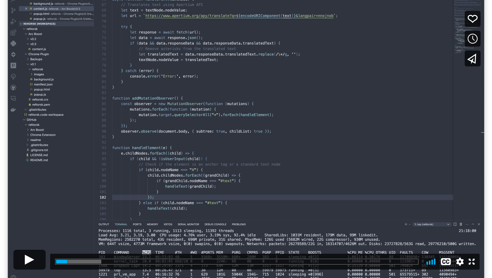

 

  

<h3 align="center">'<s>ny</s>Norskroboten'</h3>

  

    Retter aktive nettside fra nynorsk til norsk (bokmål), for økt leseglede &#9829;
     
     
    <a href="#intro"><strong>Intro</strong></a>
    ·
    <a href="#chrome"><strong>Chrome utvidelse</strong></a>
    ·
    <a href="#installasjon"><strong>Installasjon (dev)</strong></a>
    ·
    <a href="#demo"><strong>Demo</strong></a>

  

## reNorsk · Nettleserutvidelse
Chrome-utvidelse & Arc Boost som tar bort smerten av å lese nettinnhold fra de ~25% offentlige nettpublikasjoner som på grunn av språkloven ikke blir tilgjengeliggjort på norsk (bokmål).

### Forbehold
- Tidlig test / 'Proof of Concept'. Programmet gjør jobben, men enkelte feil må påregnes. Foreløpig ikke publisert i Chrome Webshop. Se installasjonsveiledning under.
- Benytter Apertiums åpne API (https://wiki.apertium.org/) for maskinoversettelse og er underlagt deres ToS.

## Chrome Utvidelse
**TBA**. Lenke til chrome nettmarked tilgjengeliggjøres så snart utvidelsen er godkjent og publisert (sist oppdatert 08.09.2025).

## Installasjon
### Chrome-utvidelse

Utvidelsen kan benyttes på alle chromium-baserte nettlesere (som Chrome, Vivaldi, Arc, Brave, Opera m.fl.). Tilgjengeliggjøres snart i Chrome Nettmarked (TBA), men kan også installeres manuelt på følgende vis:

#### Installasjon · Chrome
1. Åpne Chrome (eller annen Chromium-basert nettleser) og gå til menyen for utvidelser: [chrome://extensions/](chrome://extensions/)[^1].
2. Skru på 'Developer Mode' øverst i høyre hjørne.
3. I enkelte versjoner av Chrome kan du laste ned [reNorsk.crx](GitHub/reNorsk/ChromeExtension/v3/reNorsk.crx) (Chromium Extension) og dra/slippe denne rett i chrome://extensions/.
4. Hvis dette ikke går, laster du ned [reNorsk.zip](GitHub/reNorsk/ChromeExtension/v3/reNorsk.zip) (evt. endrer filnavn på .crx til .zip), og pakker ut.
5. Velg 'Load unpacked' fra menyen øverst til venstre, og velg mappen du pakket ut fra .zip-filen (reNorsk/).
6. Du kan nå skru av 'Developer Mode'.

#### Bruk · Chrome
Benytt enten knappen fra utvidelsesikonet (rN), eller Cmd+Shift+Y[^2] når du treffer på en tekst som bare er publisert på nynorsk, for å 'rette' denne til norsk.

#### Nedlastinger · Chrome (Chrome Manifest V3 - 2025)

[:-reNorsk.crx-B5DAC0?style=flat&logo=download&logoColor=white)](ChromeExtension/v3/reNorsk.crx)
[:-reNorsk.zip-B5DAC0?style=flat&logo=download&logoColor=white)](ChromeExtension/v3/reNorsk.zip)

#### Nedlastinger · Chrome (Chrome Manifest V2 - Utgått)

[:-reNorsk.crx-B5DAC0?style=flat&logo=download&logoColor=white)](ChromeExtension/v2/reNorsk.crx)
[:-reNorsk.zip-B5DAC0?style=flat&logo=download&logoColor=white)](ChromeExtension/v2/reNorsk.zip)

[^1]: Benytt tilsvarende adresse for å komme til menyen for utvidelser i andre Chromium-baserte nettlesere, f.eks: vivaldi://extensions/, arc://extensions/, brave://extensions.
[^2]: Mac: Cmd+Shift+Y/ Win: Ctrl+Shift+Y. Hvis snarveien ikke settes automatisk kan du sette denne manuelt fra [chrome://extensions/shortcuts](chrome://extensions/shortcuts).

### Arc Boost

#### Installasjon · Arc Boost
1. Last ned Arc Browser (https://arc.net).
2. Åpne: [arc://boost/](arc://boost/), eller Cmd+T og skriv 'New Legacy Boost (Advanced)'[^3].
3. Velg 'Replace' og 'All Websites'.
4. Kopier og lim inn følgende [JavaScript](Arc%20Boost/v0.3/content.js) til content.js.
   
#### Bruk · Arc Boost
Trykk Cmd+Ctrl+R[^4] når du treffer på en tekst som bare er publisert på nynorsk, for å 'rette' denne til norsk.

#### Nedlastinger · Arc Boost

[^3]: Mer informasjon om New Legacy Boosts: https://resources.arc.net/hc/en-us/articles/19212718608151-Boosts-Customize-Any-Website
[^4]: Mac: Cmd+Ctrl+R / Win: Ctrl+Alt+R (For å ikke komme i konflikt med Cmd+Shift+Y om du også tester chrome utvidelsen).

## Demo

### Chrome (Chrome Manifest V3 - 2025)

### Chrome (Chrome Manifest V2 - Utdatert)

 

(<a href="#readme-top">Tilbake til toppen</a>)
